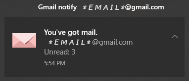

# Gmail notify

*Gmail notify* notifies you of new mail in Gmail.



## Feature

- Notifies using Windows notifications.
- Stand-alone service. You don't need Chrome instance.
- Supported multi account.

## Install

1. Prepare *notify.exe*, *get-token.exe* and *config.json*.
``` Text
cd cmd/notify; go build 
cd cmd/get-token; go build 
```

2. Download Google user's *credentials.json* from [google](https://developers.google.com/gmail/api/quickstart/go) ...by clicking [Enable the Gmail API] button.
And save it in a sub directory of the directory that contains *notify.exe*.
The name of the directory can be anything you want.

3. Create *token.json*.
``` Text
get-token.exe ENTRY-DIRECTORY
```
Follow the displayed link, and type code to create *token.json*.

Repeat steps #2-#3 for all the accounts you need.
Once executed, *notify.exe* creates working file named *unread.json*.
Finally, directory structure looks this:

``` Text
[gmail-notify]
    config.json
    get-token.exe
    notify.exe
    notify.log    
    [ENTRY DIRECTORY 1]
        credentials.json
        token.json
        unread.json
    [ENTRY DIRECTORY 2]
        credentials.json
        token.json
        unread.json
    :
    [ENTRY DIRECTORY x]
        credentials.json
        token.json
        unread.json
```

## Setup Task scheduler

If it works, add an entry to the Windows task scheduler.

- Triggers : `At log on`
- Actions :  `Start a program` (notify.exe), Start in `same directory` with *notify.exe*.
